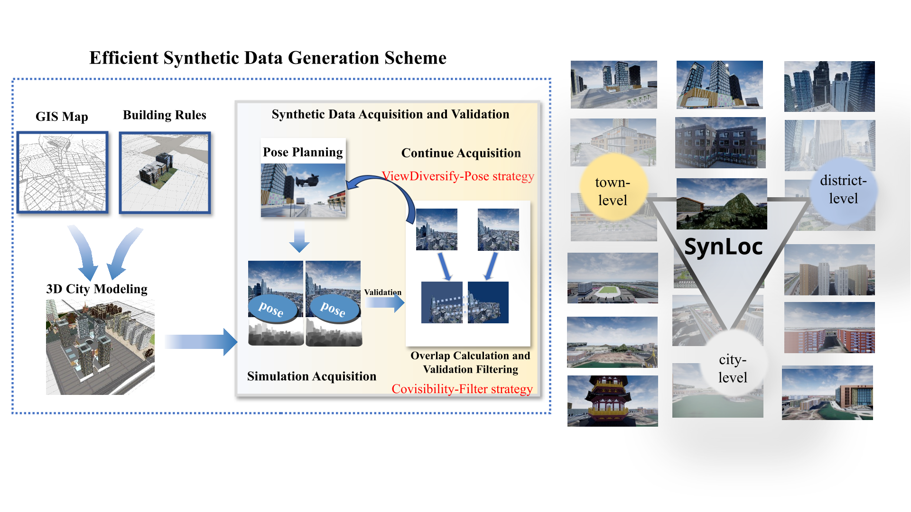

<p align="center">
  <h1 align="center">Virtual Modeling-Based Synthetic Data Generation for Enhanced Visual Localization</h1>
  <p align="center">
    <a href="https://scholar.google.com/citations?xx">Google Scholar</a>
    <a href="https://huggingface.co/ledgero/VMBSDG_roma">🤗 Hugging Face</a>
  </p>
</p>
<p align="center">
  
</p>

<br/>

## Setup/Install

In your python environment (tested on Linux python 3.12), run:

```bash
uv pip install -e .
```

or

```bash
uv sync
```

You can also install `romatch` directly as a package from PyPI by

```bash
uv pip install romatch
```

## Pre-trained Weights

Our pre-trained model weights are available on Hugging Face:

🤗 **Hugging Face Hub**: [ledgero/VMBSDG_roma](https://huggingface.co/ledgero/VMBSDG_roma)

You can download them programmatically:

```python
from huggingface_hub import hf_hub_download

model_path = hf_hub_download(
    repo_id="ledgero/VMBSDG_roma",
    filename="model.ckpt"  # or the actual filename
)
```

Or download manually from the [model page](https://huggingface.co/ledgero/VMBSDG_roma).

## Demo / How to Use

We provide two demos in the [demos folder](demo).
Here's the gist of it:

```python
from romatch import roma_outdoor

roma_model = roma_outdoor(device=device)

# Match
warp, certainty = roma_model.match(imA_path, imB_path, device=device)

# Sample matches for estimation
matches, certainty = roma_model.sample(warp, certainty)

# Convert to pixel coordinates (RoMa produces matches in [-1,1]x[-1,1])
kptsA, kptsB = roma_model.to_pixel_coordinates(matches, H_A, W_A, H_B, W_B)

# Find a fundamental matrix (or anything else of interest)
F, mask = cv2.findFundamentalMat(
    kptsA.cpu().numpy(), kptsB.cpu().numpy(),
    ransacReprojThreshold=0.2,
    method=cv2.USAC_MAGSAC,
    confidence=0.999999,
    maxIters=10000
)
```

**New**: You can also match arbitrary keypoints with RoMa. See [match_keypoints](romatch/models/matcher.py) in RegressionMatcher.

## Evaluation

To evaluate the model on MegaDepth-1500, run:

```bash
python eval/test_mega1500.py --model_path /path/to/downloaded/model.ckpt
```

Make sure you have downloaded the pre-trained weights (see [Pre-trained Weights](#pre-trained-weights)) and set up the dataset symlinks (see [Datasets](#datasets)) before running evaluation.

## Datasets

### SynLoc

Dataset link: [Baidu Netdisk](https://pan.baidu.com/s/1_2v912GbhjP0P7J-8GbcZg?pwd=pvjq) (提取码: pvjq)

### MegaDepth

We use depth maps provided in the [original MegaDepth dataset](https://www.cs.cornell.edu/projects/megadepth/) as well as undistorted images, corresponding camera intrinsics and extrinsics preprocessed by D2-Net. You can download them separately from the following links.

### Build the dataset symlinks

We symlink the datasets to the `data` directory under the main project directory.

```bash
# MegaDepth
# -- train and test dataset (train and test share the same dataset)
ln -sv /path/to/megadepth/phoenix /path/to/megadepth_d2net/Undistorted_SfM /path/to/project/data/megadepth/train
ln -sv /path/to/megadepth/phoenix /path/to/megadepth_d2net/Undistorted_SfM /path/to/project/data/megadepth/test

# -- dataset indices
ln -s /path/to/megadepth_indices/* /path/to/project/data/megadepth/index

# SynLoc
ln -s /path/to/SynLoc_train/* /path/to/project/data/SynLoc/train
```

## Settings

### Resolution

By default RoMa uses an initial resolution of `(560, 560)` which is then upsampled to `(864, 864)`.
You can change this at construction (see `roma_outdoor` kwargs).
You can also change this later by modifying:
- `roma_model.w_resized`
- `roma_model.h_resized`
- `roma_model.upsample_res`

### Sampling

`roma_model.sample_thresh` controls the thresholding used when sampling matches for estimation. In certain cases a lower or higher threshold may improve results.

## Training

1. First follow the instructions provided here: https://github.com/Parskatt/DKM for downloading and preprocessing datasets.
2. Run the relevant experiment, e.g.,

```bash
torchrun --nproc_per_node=4 --nnodes=1 --rdzv_backend=c10d experiments/roma_outdoor.py
```

## Testing

```bash
python experiments/roma_outdoor.py --only_test --benchmark mega-1500
```

## License

All our code except DINOv2 is MIT license.
DINOv2 has an Apache 2 license [DINOv2](https://github.com/facebookresearch/dinov2/blob/main/LICENSE).

## Acknowledgement

Our codebase builds on the code in [RoMa](https://github.com/Parskatt/RoMa).
